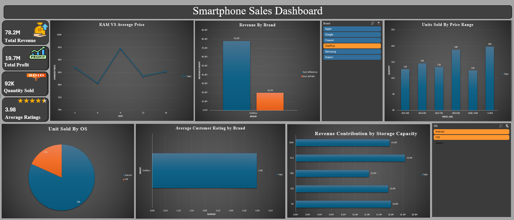

# 📱 Smartphone Sales Analysis Dashboard

## 📌 Project Overview  
This project focuses on analyzing smartphone sales data to uncover key trends and insights. The dashboard provides a clear visualization of sales performance across different brands, regions, and time periods using Power BI.

---

## 🎯 Objectives  
- Analyze overall smartphone sales performance  
- Identify top-performing brands and models  
- Understand regional sales distribution  
- Track sales trends over time  
- Provide data-driven business insights  

---

## 🛠️ Tools & Technologies  
- Power BI (Dashboard & Visualization)  
- Microsoft Excel (Data Cleaning & Preparation)  

---

## 📊 Dashboard Features  
- 📈 Sales trend analysis  
- 🏆 Top brands and models comparison  
- 🌍 Region-wise sales insights  
- 💰 Revenue and quantity analysis  
- 🔍 Interactive filters  

---

## 📂 Dataset  
The dataset includes:  
- Smartphone brands and models  
- Sales quantity  
- Revenue  
- Region-wise data  
- Time-based sales  

---

## 📊 Dashboard Preview  
(Add your screenshot after uploading)

---

## 🔍 Key Insights  
- Top brands dominate the overall market share  
- Regional differences impact sales performance  
- Seasonal trends influence smartphone sales  
- Premium models generate higher revenue  

---

## 🚀 How to Use  
1. Download the `.pbix` file from this repository  
2. Open it in Power BI Desktop  
3. Use filters to explore insights  

---

## 📌 Conclusion  
This project helps understand smartphone sales patterns and supports better business decision-making using data visualization.

---

## 📎 Author  
**Sakshi More**
